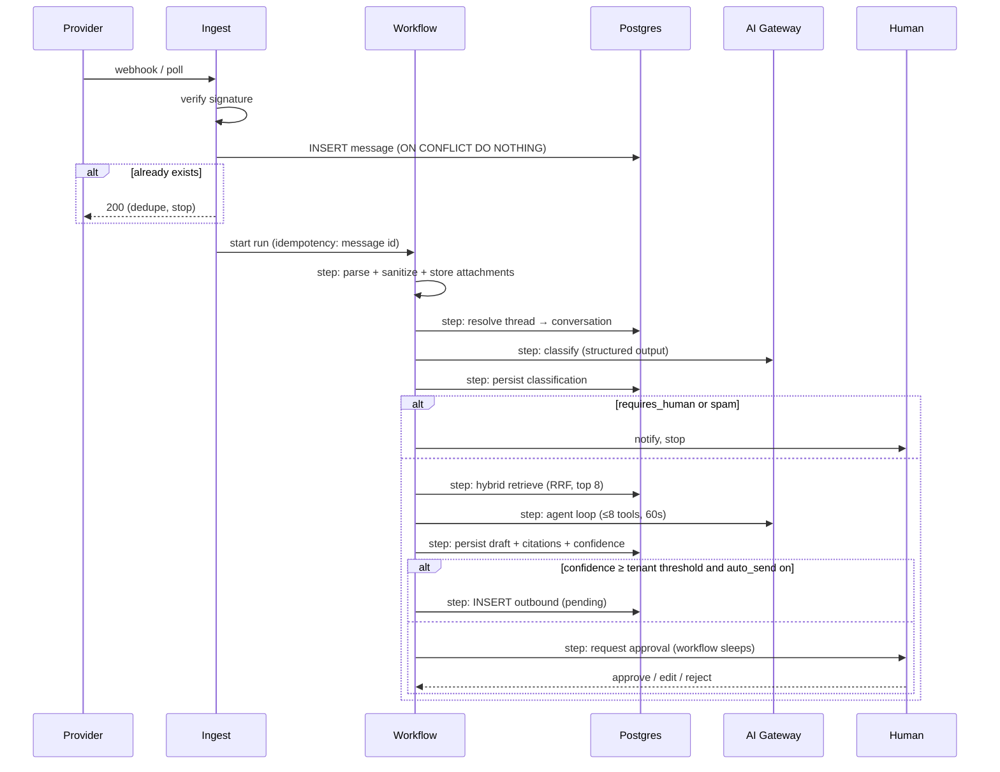

> **Shard of [Architecture](../../Email%20Engine%20Architecture.md) §8.**
> Derived file — edit the source document and re-shard, never this copy.

## 8. Core workflows

### 8.1 Inbound email → reply



Each `step:` is a Workflow checkpoint. If the model call times out, only that step retries — the parse, the thread resolution, and the attachment uploads are not redone.

> [!warning] The pipeline branches once, early: a bounce is an inbound email — ruled 2026-08-06 (Story 6.5)
> There is no bounce API for Gmail, Graph, or SMTP. **The delivery status notification *is* the notification**, and it arrives through the webhook and the poll like any customer message.
>
> Followed through the diagram above: it parses cleanly; **§4.3 stitches it into the original conversation**, because a DSN carries the failed message's `In-Reply-To`/`References`, which is exactly what thread resolution matches on; the classifier labels it as customer mail; **the agent drafts a grounded, cited reply**; and above threshold, auto-send **mails `MAILER-DAEMON`.** That reply bounces, and the loop runs at the drain's cadence — **a mail loop assembled from five individually-correct stories.** Meanwhile FR44's "surface the delivery failure on the conversation" never happens, because the failure was ingested *as* a conversation.
>
> **Ruling: detect the DSN in the parse step and branch before classification.** `Content-Type: multipart/report; report-type=delivery-status` (RFC 3464) with sender heuristics as fallback. **This is deliberately not the classifier's job** — "is this a bounce" is answerable from a header, and must not depend on a model call that can fail open. The DSN attaches to the conversation as a `conversation_events` row of type `bounced` and never reaches drafting.
>
> **`bounced` was already in §6.7's CHECK list.** The record was designed and the detection was not — the F3/F8 shape again. The flag belongs in Story 2.5's parser; that story is `Draft, not Approved` and the scope change is raised for the PO rather than assumed.

### 8.2 Outbound send

Cron every 30s → claim up to N pending rows per tenant in one statement:

```sql
UPDATE outbound_messages SET state='claimed', attempt_count = attempt_count + 1
WHERE id IN (
  SELECT id FROM outbound_messages
  WHERE state='pending' AND scheduled_for <= now()
  ORDER BY scheduled_for
  LIMIT 50
  FOR UPDATE SKIP LOCKED
)
RETURNING *;
```

`FOR UPDATE SKIP LOCKED` lets concurrent drains coexist without double-sending. Send via connector → `sent` + provider id, or `failed` with backoff (`scheduled_for = now() + interval`), or `dead` after 5 attempts.

> [!important] The statement above claims nothing, and returns too much — corrected 2026-08-06 (Story 6.1)
> **It runs with no tenant.** `/api/cron/drain-outbox` has no session, `outbound_messages` carries `USING (tenant_id = current_tenant_id())`, the predicate is NULL, and the policy denies — so the drain claims **zero rows and sends nothing, silently.** The 2026-08-05 cron finding, in the one job whose purpose is that replies leave the building.
>
> **And `RETURNING *` is a cross-tenant read of full rows** — `last_error`, `provider_message_id`, `draft_id`, `conversation_id` for fifty rows of any tenant, on the system connection. §10.2's category-two rule is explicit that an enumerator returning rows is a cross-tenant read with a job title.
>
> **The two rules genuinely conflict here**, which is why this needed a ruling. §10.2 says enumerate identifiers then re-enter `withTenant()`; AC2 says the claim is a single atomic statement, and that atomicity is what makes exactly-once true. Split them and two drains enumerate the same row and both claim it — `SKIP LOCKED` is defeated precisely by being obeyed in two steps.
>
> **Ruling: the atomic claim *is* the escape hatch, returning `(tenant_id, outbound_id)` and nothing else.** `outbound_claim_due(p_limit int)`, `SECURITY DEFINER`, pinned `search_path`, `REVOKE` then `GRANT` — and **`VOLATILE`, not `STABLE`, because it writes.** It is the only category-two function that mutates, and that is what makes it atomic. Everything after the claim happens inside `withTenant()` per tenant, so the system connection never sees message content. Full SQL in Story 6.1.
>
> **Renamed from `outboundDue` to `outboundClaimDue`** in §10.2's table: a name that says "due" invites a future reader to call it twice.

> [!important] A claimed row that crashes is in an *unknown* state, not a failed one — ruled 2026-08-06
> Retry it and the customer may get two replies (AC3 forbids); abandon it and the reply may never send (NFR18 forbids). **Resolution requires asking the provider what it did** — and §4.1's uniform `send(message)` interface, which exists so the rest of the system never branches on provider, is what makes the story read implementable when it is not. **Recovery genuinely branches on provider.**
>
> The composer generates and persists the `Message-ID` **before** the attempt; the connector gains `findSent(mailboxId, messageId)`; recovery looks for our own id in sent items. Gmail (`rfc822msgid:`) and Graph (`internetMessageId`) can. **SMTP cannot** — an IMAP `APPEND` to Sent is a separate operation from the send and may not have happened — so a stale `claimed` row on an SMTP mailbox is **escalated to a human, never auto-retried.** A permanent property of the protocol, not a gap to close. See §4.1.

### 8.3 Knowledge base indexing

Upload/URL → Workflow: fetch → extract (pdf/html/md) → chunk (~500 tokens, 15% overlap, respect headings) → embed in batches of 96 → upsert `kb_chunks` → mark source `indexed`. Re-index diffs by content hash so an unchanged page costs nothing.

### 8.4 Tenant onboarding

Clerk org created → webhook → `tenants` row → seed default persona + FAQ → OAuth mailbox connect → initial 30-day backfill (throttled, separate workflow) → "connected" state in the dashboard.

---
