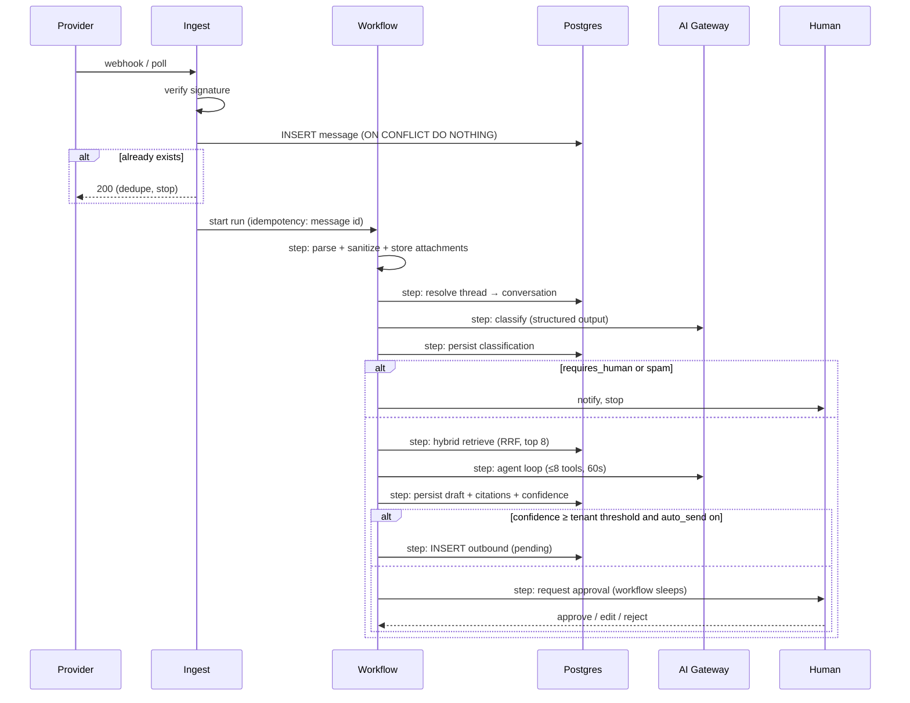

> **Shard of [Architecture](../../Email%20Engine%20Architecture.md) §8.**
> Derived file — edit the source document and re-shard, never this copy.

## 8. Core workflows

### 8.1 Inbound email → reply



Each `step:` is a Workflow checkpoint. If the model call times out, only that step retries — the parse, the thread resolution, and the attachment uploads are not redone.

### 8.2 Outbound send

Cron every 30s → claim up to N pending rows per tenant in one statement:

```sql
UPDATE outbound_messages SET state='claimed', attempt_count = attempt_count + 1
WHERE id IN (
  SELECT id FROM outbound_messages
  WHERE state='pending' AND scheduled_for <= now()
  ORDER BY scheduled_for
  LIMIT 50
  FOR UPDATE SKIP LOCKED
)
RETURNING *;
```

`FOR UPDATE SKIP LOCKED` lets concurrent drains coexist without double-sending. Send via connector → `sent` + provider id, or `failed` with backoff (`scheduled_for = now() + interval`), or `dead` after 5 attempts.

### 8.3 Knowledge base indexing

Upload/URL → Workflow: fetch → extract (pdf/html/md) → chunk (~500 tokens, 15% overlap, respect headings) → embed in batches of 96 → upsert `kb_chunks` → mark source `indexed`. Re-index diffs by content hash so an unchanged page costs nothing.

### 8.4 Tenant onboarding

Clerk org created → webhook → `tenants` row → seed default persona + FAQ → OAuth mailbox connect → initial 30-day backfill (throttled, separate workflow) → "connected" state in the dashboard.

---

