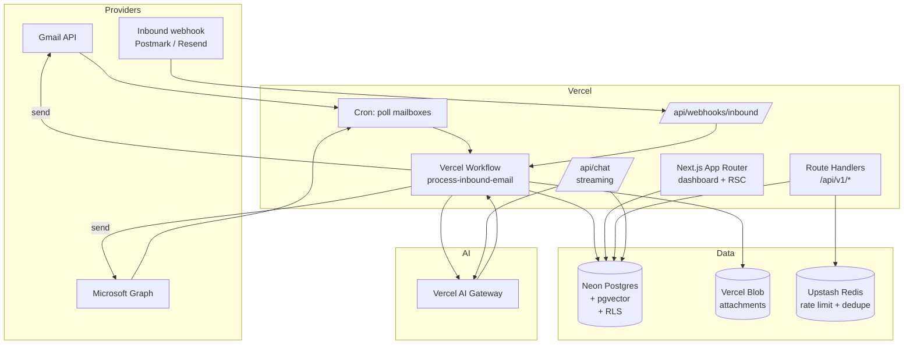

> **Shard of [Architecture](../../Email%20Engine%20Architecture.md) §2.**
> Derived file — edit the source document and re-shard, never this copy.

## 2. High-level architecture

### 2.1 Technical summary

Email Engine is a **serverless, event-driven monolith** deployed as a single Next.js application on Vercel, with a sharp separation between the *synchronous* surface (dashboard, API) and the *asynchronous* surface (ingest, classify, draft, send). Every inbound email becomes a durable workflow run; every workflow step is idempotent and resumable. Tenancy is enforced at the PostgreSQL row level so a bug in application code cannot leak data across customers.

The AI layer is deliberately thin: a single `agent()` module owns model selection, tool definitions, and retrieval, and it talks to **Vercel AI Gateway** rather than any provider SDK directly. Swapping or failing over between models is a config change, not a code change, and the deployment holds one gateway credential instead of a key per vendor.

### 2.2 Platform choice

**Vercel + Neon Postgres + Clerk.**

- **Vercel** — Next.js is first-party, Fluid Compute keeps streaming AI responses cheap, Workflow gives durable execution without standing up a queue cluster, Cron covers the polling ingest path, and preview deployments per PR make the BMAD story loop reviewable.
- **Neon** (provisioned through Vercel Marketplace) — real Postgres, so RLS, `pgvector`, partial indexes, and `LISTEN/NOTIFY` are all on the table. Database branching per preview deployment mirrors the Vercel model. Serverless driver over HTTP works inside Functions without connection-pool exhaustion.
- **Clerk** — Organizations map 1:1 to tenants, invitations and roles are built in, and the JWT can carry `org_id` as a claim we pass straight into the Postgres session for RLS.

### 2.3 Repository structure

**Monorepo, Turborepo, npm workspaces.** Chosen because the AI tool schemas, DB types, and email parsers are shared between the Next.js app and the workflow functions.

```
apps/web            Next.js 16 — dashboard + API routes + workflows
packages/db         Drizzle schema, migrations, RLS policies, seed
packages/email      MIME parse, thread stitching, sanitize, render
packages/ai         Agent, tools, retrieval, prompt assembly, evals
packages/ui         shadcn/ui registry + shared components
packages/config     eslint, tsconfig, tailwind preset
```

### 2.4 System diagram



### 2.5 Architectural patterns

| Pattern | Where | Why |
|---|---|---|
| **Durable workflow per email** | `process-inbound-email` | Ingest → classify → retrieve → draft → send is a multi-minute, multi-failure-mode chain. Steps checkpoint; a model timeout retries one step, not the whole email. |
| **Idempotency by provider message-id** | ingest step | Webhooks redeliver and polls overlap. `UNIQUE (tenant_id, provider_message_id)` is the source of truth, not a Redis lock. |
| **RLS as the tenancy boundary** | every tenant table | A missing `WHERE tenant_id = ?` becomes an empty result set, not a breach. |
| **Repository pattern** | `packages/db/repositories` | Route handlers never build SQL. Keeps the RLS session setup in exactly one place. |
| **Server Components by default** | dashboard | Data fetching stays on the server; the client bundle carries only interactive islands. |
| **Server Actions for mutations** | forms | No hand-written CRUD endpoints for first-party UI. The public REST API (§7) exists separately, for customers. |
| **Outbox for outbound mail** | `outbound_messages` | Send is the only irreversible act. It gets a transactional outbox with explicit state so a retry can never double-send. |
| **Tool-calling agent, not prompt-chaining** | `packages/ai` | The model decides whether to search the KB, look up an order, escalate, or reply. Deterministic chains break on the long tail. |

---

